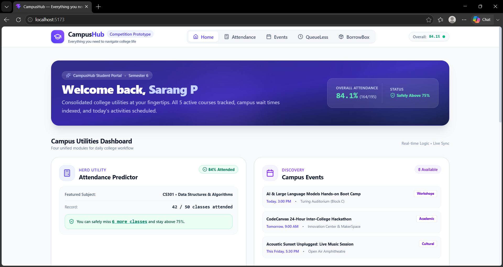
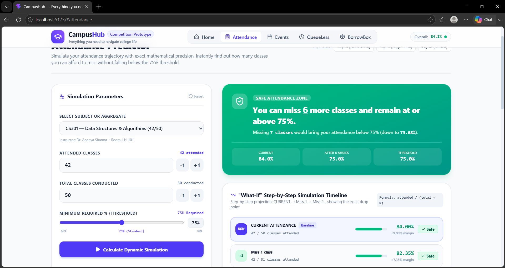
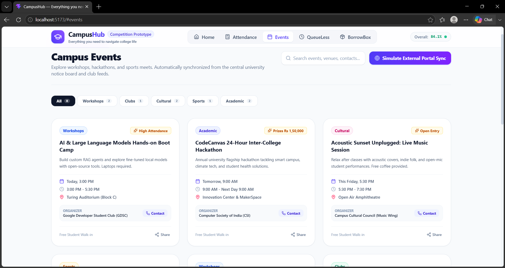
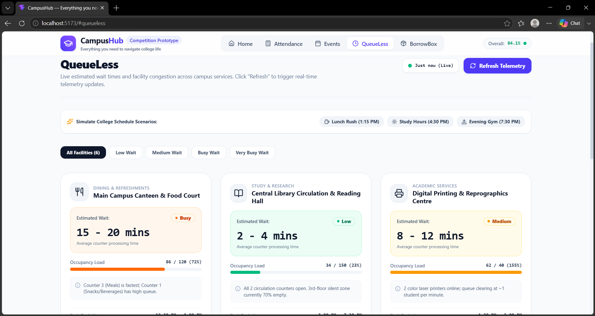
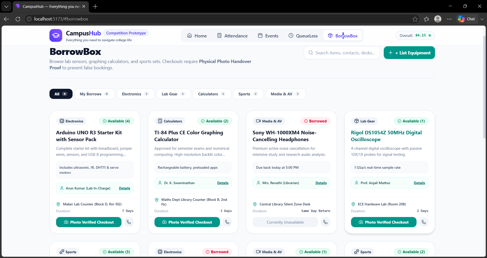

# 🏫 CampusHub

> **One place to make everyday college life easier.**

CampusHub is a student-focused web platform that brings together the small but frustrating problems of campus life into one simple interface.

Instead of switching between different notices, spreadsheets, WhatsApp groups, campus counters, and lending desks, students can use CampusHub to:

* 📊 Predict and protect their attendance
* 📅 Discover campus events
* ⏱️ Check facility crowd levels before going
* 📦 Borrow campus equipment without unnecessary hassle

Built as a **zero-backend, portable prototype** for rapid demonstration and real-world campus use cases.
## 🌐 Live Demo

👉 **[Visit CampusHub Live Website](https://sarangp-c.github.io/CampusHub/)**
---

## 🎯 Why CampusHub?

College students repeatedly face four simple problems:

| Problem                              | CampusHub Solution      |
| ------------------------------------ | ----------------------- |
| "Can I miss tomorrow's class?"       | 📊 Attendance Predictor |
| "What events are happening today?"   | 📅 Campus Events        |
| "Is the canteen/library crowded?"    | ⏱️ QueueLess            |
| "Where can I borrow this equipment?" | 📦 BorrowBox            |

CampusHub focuses on **actionable answers instead of simply displaying information**.

---

# ⭐ Main Features

## 1. 📊 Attendance Predictor & Recovery Engine

The **core feature of CampusHub**.

Most attendance systems only tell students their current percentage. CampusHub goes further and answers the questions students actually care about:

> **"If I miss my next class, what will my attendance become?"**

> **"How many more classes can I safely miss?"**

> **"How many classes do I need to attend to recover?"**

### Key capabilities

* **Precise threshold mathematics**

  * Calculates attendance dynamically instead of relying on hardcoded percentages.
  * Evaluates the mandatory **75% attendance threshold**.

* **What-If Drop-Point Timeline**

  * Simulates missed classes one at a time.
  * Shows exactly when attendance drops below the required threshold.

* **Recovery Calculator**

  * Calculates how many consecutive classes must be attended to recover to **≥75%**.

* **Subject Presets**

  * Quickly load sample semester subjects such as `CS301–CS305`.

### Example

```text
Current Attendance
82%

Miss 1 class
↓
80%

Miss 2 classes
↓
78%

Miss 3 classes
↓
76%

Miss 4 classes
↓
73%  ← Below threshold
```

The system identifies the **exact drop point**, rather than making an approximate prediction.

---

## 2. 📅 Campus Events

CampusHub provides a centralized place to discover upcoming college activities.

### Features

* 🔄 External portal ingestion simulation
* 🟢 "Synced from Portal" status indicators
* 🔎 Instant event search
* 🏷️ Category filtering
* 📞 Organizer contact information
* 📧 Email and phone contact options

### Event categories

* Workshops
* Clubs
* Cultural
* Sports
* Academic

### Data architecture

The prototype includes a simulated external portal ingestion layer so the complete synchronization experience can be demonstrated without depending on an unavailable university API.

> **Prototype note:** The current implementation uses bundled/sample event data and simulates external portal synchronization. It is architected so that a real university API can replace the mock ingestion layer later.

---

## 3. ⏱️ QueueLess — Campus Facility Telemetry

Students often waste time walking to a facility only to find a long queue.

**QueueLess** provides an at-a-glance view of campus facility activity.

### Monitored facilities

* 🍴 Canteen
* 📚 Library
* 📝 Stationery Desk
* 🏋️ Gym
* 🏢 Admin Office
* 🔬 Lab

### Features

* Live-style occupancy indicators
* Estimated waiting time
* Queue/load percentages
* Peak-hour alerts
* Simulated sensor refresh
* Visitor increase/decrease indicators

Example telemetry:

```text
Visitors
▲ +5

or

▼ -3
```

### Quick schedule presets

Students can jump directly to common campus periods:

* 🍱 Lunch Rush — 1:15 PM
* 📚 Study Hours — 4:30 PM
* 🏋️ Evening Gym — 7:30 PM

The prototype simulates IoT-style telemetry so the experience can be demonstrated without physical sensors.

---

## 4. 📦 BorrowBox — Campus Equipment Lending

Students often need equipment for only a few hours or days.

Instead of buying expensive equipment or searching around campus, **BorrowBox** provides a centralized lending experience.

### Example equipment

* Calculators
* Adapters
* Sports equipment
* Lab kits
* Academic equipment

### Features

#### 📦 Equipment Catalog

View available equipment, quantity, lending windows, and desk information.

#### 📸 Physical Handover Verification

The prototype supports a physical handover workflow involving:

* Item photograph
* Condition checklist
* Timestamp
* Handover verification

This creates a visual record of the item's condition when it is issued.

#### 🖼️ Verification Gallery

Borrowed items contain expandable proof thumbnails with a full inspection view.

#### 🔄 Return Flow

When an item is returned:

```text
Borrowed
   ↓
Return to Counter
   ↓
Verification Archived
   ↓
Stock Restored
   ↓
Available Again
```

#### 👤 Desk Transparency

Equipment listings can display the responsible coordinator's contact information.

---

# 🖥️ Screenshots

### 🏠 Student Dashboard



### 📊 Attendance Predictor



### 📅 Campus Events



### ⏱️ QueueLess



### 📦 BorrowBox


---

# 🚀 Running the Project

## Prerequisites

Make sure you have:

* **Node.js**
* **npm**
* A modern browser such as Chrome, Edge, or Firefox

Check your installation:

```bash
node --version
npm --version
```

## Installation

Clone the repository:

```bash
git clone https://github.com/sarangp-c/CampusHub.git
```

Enter the project directory:

```bash
cd CampusHub
```

Install dependencies:

```bash
npm install
```

Start the development server:

```bash
npm run dev
```

Open the local URL shown by Vite, typically:

```text
http://localhost:5173
```

---

# 🏗️ Project Structure

```text
CampusHub/
│
├── public/
│
├── src/
│   ├── components/
│   │   ├── Navbar.tsx
│   │   ├── Footer.tsx
│   │   └── AttendanceGauge.tsx
│   │
│   ├── data/
│   │   └── mockData.ts
│   │
│   ├── pages/
│   │   ├── HomePage.tsx
│   │   ├── AttendancePage.tsx
│   │   ├── EventsPage.tsx
│   │   ├── QueueLessPage.tsx
│   │   └── BorrowBoxPage.tsx
│   │
│   ├── types/
│   │   └── campus.ts
│   │
│   ├── utils/
│   │   ├── attendanceCalculator.ts
│   │   ├── eventStore.ts
│   │   ├── facilityStore.ts
│   │   └── borrowStore.ts
│   │
│   ├── App.tsx
│   ├── main.tsx
│   └── index.css
│
├── scripts/
│   └── verify-attendance.cjs
│
├── .gitignore
├── index.html
├── package.json
├── package-lock.json
├── tsconfig.json
├── vite.config.js
└── README.md
```

---

# 🛠️ Tech Stack

| Technology                | Purpose                        |
| ------------------------- | ------------------------------ |
| **React 19**              | Frontend UI                    |
| **TypeScript**            | Type-safe application logic    |
| **Vite**                  | Development & production build |
| **Tailwind CSS v4**       | Styling                        |
| **Lucide React**          | Interface icons                |
| **Browser localStorage**  | Client-side persistence        |
| **JavaScript/TypeScript** | Application logic              |

